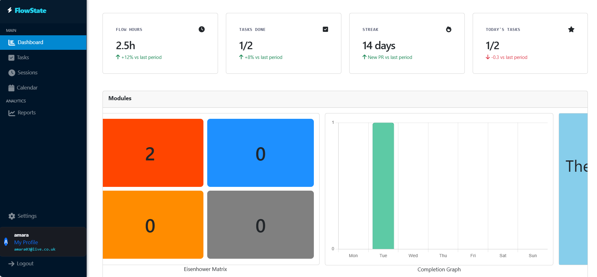
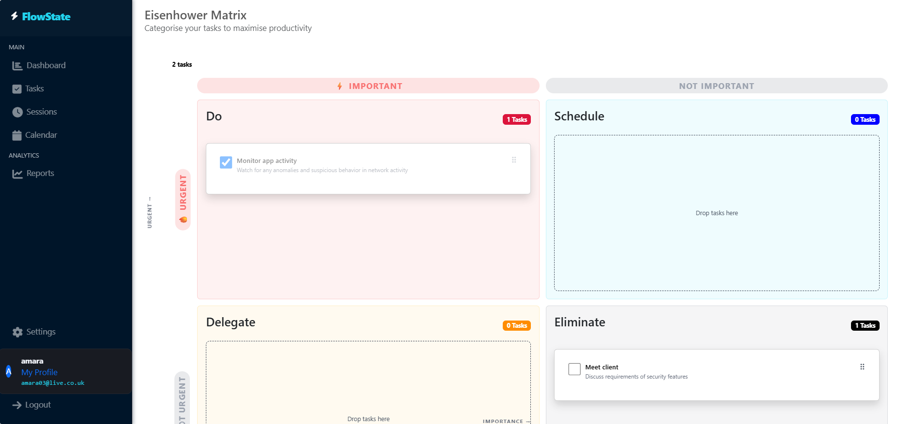
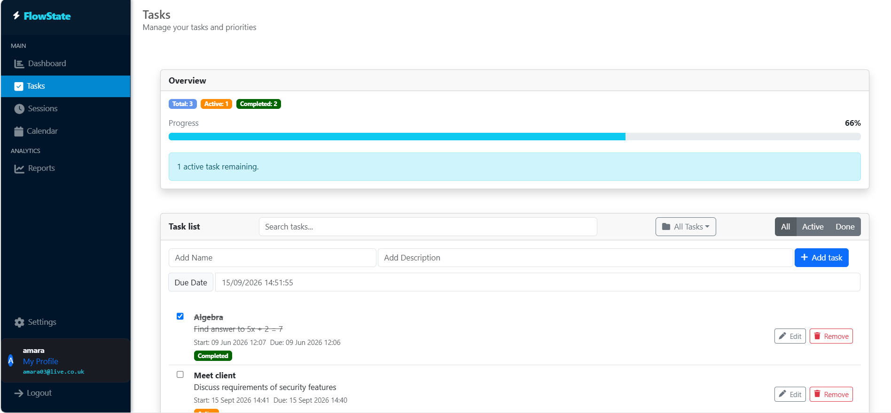

# FlowState

**A collaborative productivity app for people who plan in focus sessions, not just to-do lists.**

FlowState is a full-stack .NET 8 application that combines task management, shared workspaces, priority triage and calendar integration into a single workflow. Built with an ASP.NET Core REST API and a Blazor front end, backed by SQL Server.







---

## Features

### 🗂 Sessions — shared workspaces
Group related work into sessions and bring your team in with a single link. Creating a session makes you its admin; generating an invite mints a unique, time-limited token that anyone can redeem to join. Members can leave at any time, and every task can be assigned to a session or kept personal.

### ✅ Task management that gets out of the way
Create tasks with descriptions and due dates, search across them, and filter by active or completed. Bulk-complete or bulk-clear finished work in one action. A live progress bar tracks completion percentage and shifts colour as you close in on done.

### 🎯 Eisenhower matrix with drag-and-drop
Triage tasks across the four classic quadrants — **Do**, **Schedule**, **Delegate**, **Eliminate** — by dragging cards between them. Changes persist to the API immediately, so your prioritisation is never just a local view.

### 📊 Dashboard and analytics
See completion stats at a glance, track per-session goal progress, and review a weekly completion chart rendered with Chart.js. Filter the whole dashboard down to a single session to see how one workstream is tracking.

### 📅 Google Calendar integration
Connect a Google account through OAuth 2.0 and import upcoming calendar events straight into FlowState as scheduled tasks. Imports are deduplicated at the database level with a unique index, so re-running an import never creates duplicates.

### 🔐 Accounts and security
Registration enforces real password strength rules — minimum length plus uppercase, numeric and special characters — and passwords are hashed with BCrypt. Authentication is JWT bearer-based, with tokens carrying user identity claims and the API validating issuer, audience, lifetime and signature on every request. Users can update their email, change their username, or delete their account outright.

---

## Tech stack

| Layer | Technology |
|---|---|
| **Backend** | ASP.NET Core 8 Web API, C# |
| **Frontend** | Blazor Web App (interactive server rendering) |
| **UI** | Blazorise 2.1 · Bootstrap 5 · FontAwesome · Chart.js |
| **Data** | Entity Framework Core 9 · SQL Server |
| **Auth** | JWT bearer tokens · BCrypt password hashing |
| **Integrations** | Google Calendar API v3 (OAuth 2.0) |
| **Testing** | NUnit 3 · Moq · `WebApplicationFactory` integration tests |
| **Docs** | Swagger / OpenAPI |

---

## Architecture

FlowState is built as a genuinely decoupled client and server — the Blazor front end talks to the API over HTTP with bearer tokens, exactly as any third-party client would.

```
Browser  ──SignalR──>  Blazor front end  ──HTTPS + JWT──>  REST API  ──EF Core──>  SQL Server
```

The API follows a clean **controller → service → repository** layering, with an interface at every seam and dependencies resolved through DI. Controllers handle HTTP concerns and ownership checks, services hold business logic, and repositories own all data access — which keeps the whole stack straightforward to unit test with mocks.

On the front end, page logic lives in dedicated C# base classes rather than inline `@code` blocks, with a shared `TaskStateService` acting as the single source of truth for the current user's tasks and sessions.

**The REST API** exposes six controllers covering authentication, users, tasks, sessions, the calendar view and Google integration — around 30 endpoints in total, all documented and explorable through Swagger UI.

---

## Testing

**97 tests** across unit and integration suites:

- **Unit tests** cover controllers, services and repositories, mocking interfaces with Moq to isolate each layer.
- **Integration tests** boot the real API through `WebApplicationFactory<Program>` against a fresh in-memory database per test, signing their own JWTs to exercise authenticated routes end to end — verifying not just happy paths but that protected endpoints correctly reject unauthorised callers.

```bash
dotnet test FlowState.Tests/FlowState.Tests.csproj
```

---

## Getting started

### Prerequisites

- [.NET 8 SDK](https://dotnet.microsoft.com/download/dotnet/8.0)
- SQL Server Express — or set `"UseInMemoryDatabase": true` in `FlowState/appsettings.json` to run without it

### Setup

```bash
dotnet restore FlowState_.sln
```

```bash
dotnet ef database update --project FlowState
```

### Run

FlowState runs as two processes. Start each in its own terminal:

```bash
dotnet run --project FlowState --launch-profile https
```

```bash
dotnet run --project FlowState.Blazer/FlowState.Blazer --launch-profile https
```

Then open **https://localhost:5271**. The API's Swagger UI is at **https://localhost:5171/swagger**.

> In Visual Studio, set both `FlowState` and `FlowState.Blazer` as startup projects to launch them together.

### Optional — Google Calendar

To enable calendar import, create an OAuth 2.0 Client ID in the [Google Cloud Console](https://console.cloud.google.com/), enable the Calendar API, and register `https://localhost:5171/api/google-tasks/callback` as an authorised redirect URI. Then add your credentials to `FlowState/appsettings.Development.json`:

```json
{
  "GoogleAuth": {
    "ClientId": "<your-client-id>",
    "ClientSecret": "<your-client-secret>",
    "RedirectUri": "https://localhost:5171/api/google-tasks/callback"
  }
}
```

---

## Project structure

```
FlowState_.sln
├── FlowState/                  # REST API — controllers, services, repositories, EF Core
├── FlowState.Blazer/           # Blazor front end — pages, layouts, client services
└── FlowState.Tests/            # NUnit unit + integration tests
```

---

## Roadmap

- Role-based permissions for session admins
- Reports and settings pages
- Real-time session activity between collaborators
- Richer analytics on the dashboard

---

*Built as a full-stack .NET project exploring clean architecture, JWT authentication, third-party API integration and test-driven development.*
